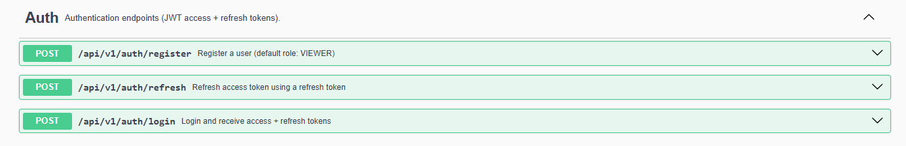
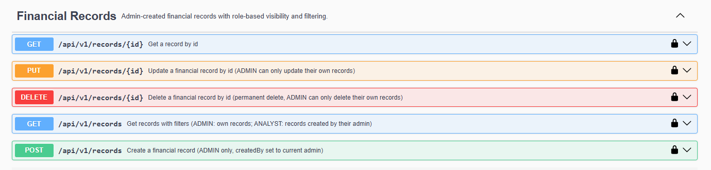
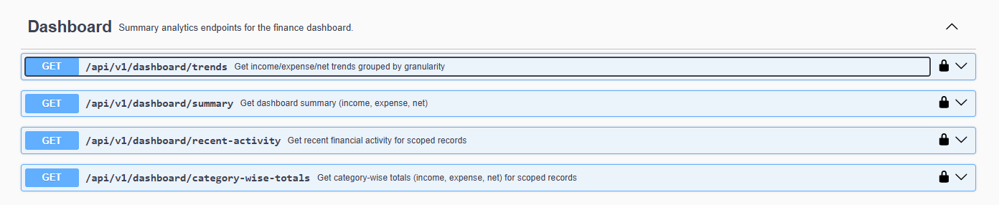
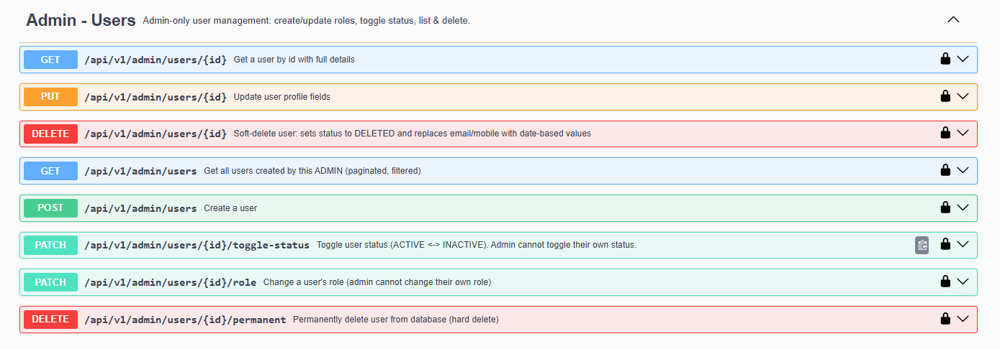

# Finance Dashboard — Backend API

A REST API for a multi-role finance dashboard system. It handles user management, financial records, and aggregated analytics — with real JWT authentication, role-based access control, and a structured permission model enforced at both the controller and service layers.

---

## System Overview

The system models a setup where admins manage financial records and create sub-users (analysts, viewers) who can interact with that data according to their role. Every piece of data is scoped: non-admin users only ever see records and analytics belonging to their assigned admin. This isn't just a filter — it's enforced structurally through the data model.

Three roles exist with clearly defined boundaries:

| Role | What they can do |
|------|-----------------|
| Admin | Full access — create records, manage users, view all analytics |
| Analyst | Read records and full analytics for their admin's data |
| Viewer | Read-only dashboard (summary, recent activity) — no access to raw records |

---

## Architecture

The project follows a strict layered architecture:

```
Controller  →  Service  →  Repository  →  Database
```

Controllers handle HTTP concerns (request binding, response codes, Swagger annotations). Services own all business logic and access control. Repositories use Spring Data JPA with the Specification pattern for composable, type-safe queries — no hand-written SQL for filtering.

**Key design decisions:**

- DTOs are Java records — immutable, concise, explicit. No entity objects leak into responses.
- All money fields use `BigDecimal`. No floats.
- Timestamps use `OffsetDateTime` (UTC) stored as `TIMESTAMPTZ` in PostgreSQL.
- Soft delete for users: status is set to `DELETED` and email/mobile are anonymized so unique constraints aren't violated.
- Financial record deletion is permanent (hard delete) — intentional, since records are financial audit data and soft-deletion semantics are handled at the user level.

---

## Database Design

Three primary tables:

**`users`** — stores all users regardless of role. Admins are users with `role = ADMIN`. Non-admin users have a foreign key `admin_id` pointing to the admin who created them.

**`financial_records`** — each record has `amount` (BigDecimal), `type` (INCOME/EXPENSE), `category`, `transaction_date`, `notes`, and a `created_by` FK to the admin who owns it. Non-admins access records through this FK — they query for records where `created_by = their admin`.

**`refresh_tokens`** — stores a SHA-256 hash of the opaque refresh token, with expiry and a `used` flag for rotation. The raw token is never stored.

Schema is managed via Hibernate DDL with `spring.jpa.hibernate.ddl-auto=update`.

---

## Security & Authentication

Authentication uses JWT (HS512). On login, the server issues two tokens:

- **Access token** (24h) — a signed JWT containing the user's role and permission set as claims
- **Refresh token** (7 days) — an opaque random token, SHA-256 hashed before storage, rotated on every use

The JWT filter (`JwtAuthenticationFilter`) runs on every request before Spring Security's filter chain. It extracts the token, validates the signature and expiry, loads the user to verify they are still active, then builds a `UsernamePasswordAuthenticationToken` with the permission authorities and sets it in the `SecurityContextHolder`.

Permission claims are embedded in the JWT at login time, so the filter constructs the authentication object without a database call to the permissions table on every request.

#### Permission model

Rather than checking `role == ADMIN` scattered across the codebase, all access control is declared via `@PreAuthorize` annotations using named authorities:

```
SUMMARY_READ      →  Viewer, Analyst, Admin
RECORD_READ       →  Analyst, Admin
ANALYTICS_READ    →  Analyst, Admin
RECORD_CREATE     →  Admin
RECORD_UPDATE     →  Admin
RECORD_DELETE     →  Admin
USER_*            →  Admin
PERMISSION_MANAGE →  Admin
ROLE_MANAGE       →  Admin
```

This means adding a new role in the future only requires updating `RolePermissionService` — no controller or service changes needed.

Spring Security's `AccessDeniedException` and `AuthenticationException` are handled explicitly in `GlobalExceptionHandler` so that 401/403 responses return the same structured JSON as every other error, not Spring's default HTML error pages.

---

## API Reference

The full interactive API is available via Swagger UI at:

```
http://localhost:8080/swagger-ui.html
```

To authenticate in Swagger: call `/api/v1/auth/login`, copy the `token` from the response, click **Authorize** (top right), and paste the token. Swagger handles the `Bearer` prefix automatically.






### Authentication — `/api/v1/auth` (public)

| Method | Path | Description |
|--------|------|-------------|
| POST | `/register` | Self-register (defaults to VIEWER role) |
| POST | `/login` | Returns access token + refresh token |
| POST | `/refresh` | Exchange refresh token for new token pair (rotation) |

### Financial Records — `/api/v1/records`

| Method | Path | Who | Notes |
|--------|------|-----|-------|
| POST | `/` | Admin | Creates record; `created_by` set to the calling admin |
| GET | `/` | Analyst, Admin | Paginated; filterable by type, category, date range, amount range |
| GET | `/{id}` | Analyst, Admin | Admin sees own records; Analyst sees their admin's records |
| PUT | `/{id}` | Admin | Update own records only |
| DELETE | `/{id}` | Admin | Permanent delete, own records only |

### Dashboard — `/api/v1/dashboard`

All dashboard data is automatically scoped: admins see their own data, non-admins see their admin's data.

| Method | Path | Who | Description |
|--------|------|-----|-------------|
| GET | `/summary?from=&to=` | Viewer, Analyst, Admin | Total income, expense, net balance |
| GET | `/recent-activity?from=&to=&limit=` | Viewer, Analyst, Admin | Latest N records by update time |
| GET | `/category-wise-totals?from=&to=` | Analyst, Admin | Income, expense, net per category |
| GET | `/trends?from=&to=&granularity=` | Analyst, Admin | Bucketed by DAILY / WEEKLY / MONTHLY |

The trends endpoint returns structured period buckets with `periodStart`, `periodEnd`, and the period label formatted per ISO 8601 (`2025-04-01` / `2025-W14` / `2025-04`). Aggregation is done in-memory using Java Streams over a Specification-filtered fetch — no raw SQL aggregation queries.

### User Management — `/api/v1/admin/users` (Admin only)

| Method | Path | Description |
|--------|------|-------------|
| GET | `/` | List users (Admin's own users); filterable by role, gender, status |
| GET | `/{id}` | Get user with full details and permissions |
| POST | `/` | Create user under this admin |
| PUT | `/{id}` | Update profile fields |
| PATCH | `/{id}/role` | Change role (cannot change own role) |
| PATCH | `/{id}/toggle-status` | Toggle ACTIVE ↔ INACTIVE (cannot toggle own status) |
| DELETE | `/{id}` | Soft delete (anonymizes email/mobile, status = DELETED) |
| DELETE | `/{id}/permanent` | Hard delete from database |

---

## Validation & Error Handling

All request DTOs use Jakarta Bean Validation (`@NotNull`, `@Size`, `@Email`, etc.). Validation errors return field-level details:

```json
{
  "status": 400,
  "message": "Validation failed",
  "details": {
    "email": "must be a valid email address",
    "amount": "must be greater than 0"
  }
}
```

Every error — validation failures, auth errors, business rule violations, not-found, conflicts — returns the same `ApiErrorResponse` structure with the appropriate HTTP status code. This includes 401 and 403 responses from the filter chain, which also return JSON instead of Spring's default error format.

---

## Setup

**Prerequisites:** Java 21+, PostgreSQL

```bash
# 1. Create database
createdb finance_db

# 2. Update credentials in src/main/resources/application.properties
spring.datasource.username=your_user
spring.datasource.password=your_password

# 3. Run
mvn clean spring-boot:run
```

The schema is created automatically on first run. Swagger UI: `http://localhost:8080/swagger-ui.html`

---

## Assumptions & Tradeoffs

- **Admin-scoped data model**: non-admins are bound to a single admin. This is a deliberate design choice — appropriate for teams where a finance admin manages records for their group.
- **Record visibility**: Viewers can see dashboard summaries but not raw financial records. Analysts can read records but not create or modify them.
- **No rate limiting**: Out of scope for this implementation.
- **Refresh token storage**: stored as SHA-256 hash; raw token is never persisted. Rotated (single-use) on every refresh call.
- **Record delete is permanent**: financial records represent actual transactions and should not be soft-deleted silently. Admins who delete a record do so intentionally.
